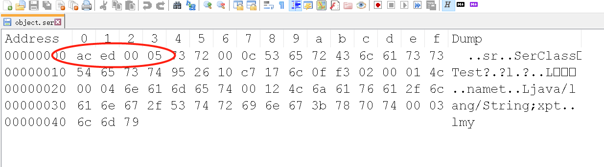
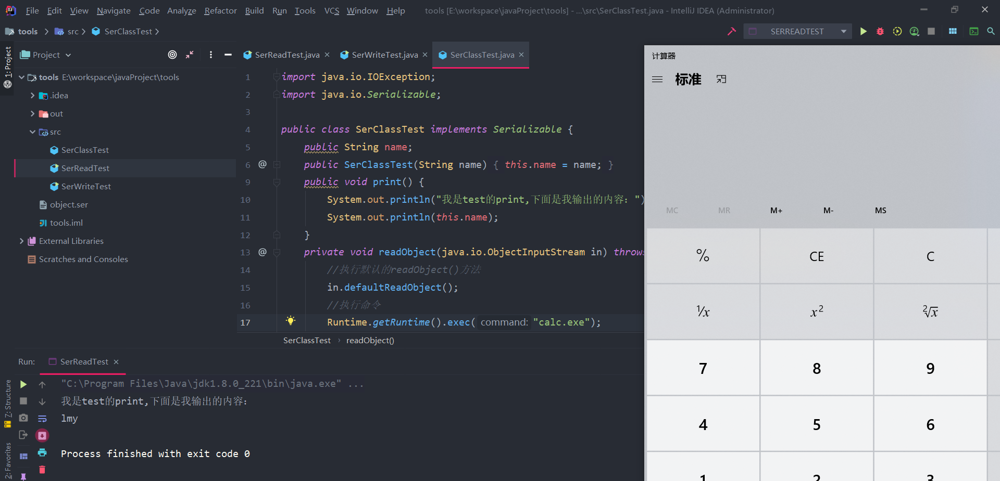

# 不安全的反序列化

## 反序列化漏洞概述
序列化就是把对象转换成字节流，便于保存在内存、文件、数据库中；反序列化即逆过程，由字节流还原成对象；java应用对用户输入，即不可信数据做了反序列化处理，那么攻击者可以通过构造恶意输入，让反序列化产生非预期的对象，非预期的对象在产生过程中就有可能带来任意代码执行。


## JAVA反序列化

java反序列化化前置条件

- 该类必须实现 java.io.Serializable 接口。
- 该类的所有属性必须是可序列化的。如果有一个属性不是可序列化的，则该属性必须注明是短暂的。

### serialVersionUID

serialVersionUID适用于java序列化机制。简单来说，JAVA序列化的机制是通过 判断类的serialVersionUID来验证的版本一致的。在进行反序列化时，JVM会把传来的字节流中的serialVersionUID于本地相应实体类的serialVersionUID进行比较。如果相同说明是一致的，可以进行反序列化，否则会出现反序列化版本一致的异常，即是InvalidCastException。

### 为什么要序列化和反序列化

类的对象会随着程序的终止而被垃圾收集器销毁。如果要在不重新创建对象的情况下调用该类，就需要通过序列化将数据转换为字节流进行存储或者传输，在合适的地方通过对字节流反序列化继续调用该类。而创建的字节流是与平台无关的，在一个平台上序列化的对象可以在不同的平台上反序列化。


### 如何进行反序列化

- 通过ObjectOutputStream类的writeObject(Object obj)方法可以实现序列化。
- 通过ObjectInputStream类的readObject(Object obj) 方法可以实现反序列化。

创建一个SerClassTest类继承java.io.Serializeble接口，SerClassTest.java:
```java
public class SerClassTest implements Serializable {
    public String name;
    public SerClassTest(String name) {
        this.name = name;
    }
    public void print() {
        System.out.println("我是test的print,下面是我输出的内容：");
        System.out.println(this.name);
    }
}
```

将SerClassTest类通过ObjectOutputStream生成序列号，SerWriteTest.java:
```java
public class SerWriteTest {
    public static void main(String[] args) throws Exception {
        SerClassTest test = new SerClassTest("lmy");
        test.print();
        FileOutputStream fos = new FileOutputStream("object.ser");
        ObjectOutputStream os = new ObjectOutputStream(fos);
        os.writeObject(test);
        os.close();
        fos.close();
    }
}
```

将SerClassTest的字节流对象通过ObjectInputStream还原，SerReadTest.java:
```java
public class SerReadTest {

    public static void main(String[] args) throws Exception {
        FileInputStream fis = new FileInputStream("object.ser");
        ObjectInputStream ois = new ObjectInputStream(fis);
        SerClassTest test =  (SerClassTest) ois.readObject();
        test.print();
        ois.close();
        fis.close();
    }
}
```

通过上面的序列化Demo，将序列化后的字节流保存在了object.ser文件中，
使用HEX查看该文件可以看到序列化特征头 `AC ED 00 05`


### 反序列化利用

在java反序列化的过程中，会调用反序列化类的方法，如果该方法书写不当，将会产生反序列化漏洞，这里以readObject方法为例:
```java
public class SerClassTest implements Serializable {
    public String name;
    public SerClassTest(String name) {
        this.name = name;
    }
    public void print() {
        System.out.println("我是test的print,下面是我输出的内容：");
        System.out.println(this.name);
    }
    private void readObject(java.io.ObjectInputStream in) throws IOException,ClassNotFoundException{
        //执行默认的readObject()方法
        in.defaultReadObject();
        //执行命令
        Runtime.getRuntime().exec("calc.exe");
    }
}
```

对该类重新进行序列化反序列化后，将会运行readObject方法里的命令，弹出计算器


实际上真实环境的反序列化漏洞的利用环境更加的复杂，需要审计出存在可控制的特殊调用方法

### 不安全的基础库
- commons-fileupload 1.3.1
- commons-io 2.4
- commons-collections 3.1
- commons-logging 1.2
- commons-beanutils 1.9.2
- org.slf4j:slf4j-api 1.7.21
- com.mchange:mchange-commons-java 0.2.11
- org.apache.commons:commons-collections 4.0
- com.mchange:c3p0 0.9.5.2
- org.beanshell:bsh 2.0b5
- org.codehaus.groovy:groovy 2.3.9
- org.springframework:spring-aop 4.1.4.RELEASE
- com.fasterxml.jackson.core: jackson-databind <= 2.9.10.6
- com.alibaba: fastjson <= 1.2.47
- Apache Shiro <= 1.2.4

### 工具

- [ysoserial](https://github.com/frohoff/ysoserial)
- [marshalsec](https://github.com/mbechler/marshalsec)


## 参考

- [玩转Ysoserial-CommonsCollection的七种利用方式分析](https://www.freebuf.com/articles/web/214096.html)
- [fastjson漏洞](https://paper.seebug.org/1343/)
- [反序列化漏洞原理](https://xz.aliyun.com/t/6787)